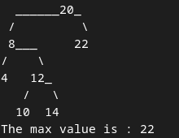
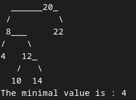
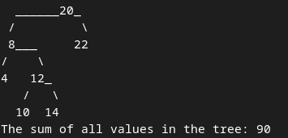

### Завдання 1 ([task1.py](task1.py))

Напишіть алгоритм (функцію), який знаходить найбільше значення у двійковому дереві пошуку або в AVL-дереві. Візьміть будь-яку реалізацію дерева з конспекту чи з іншого джерела.

### Завдання 2 ([task2.py](task2.py))

Напишіть алгоритм (функцію), який знаходить найменше значення у двійковому дереві пошуку або в AVL-дереві. Візьміть будь-яку реалізацію дерева з конспекту чи з іншого джерела.

### Завдання 3 ([task3.py](task3.py))

Напишіть алгоритм (функцію), який знаходить суму всіх значень у двійковому дереві пошуку або в AVL-дереві. Візьміть будь-яку реалізацію дерева з конспекту чи з іншого джерела.

